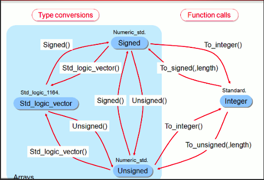
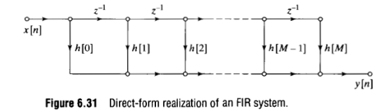
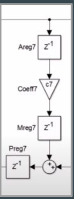

# FPGA and DSP ITBA
Repository for TP Laboratorio DSP and FPGA (ITBA)

## USB Blaster from Linux
Add this rules:
[Link](https://www.rocketboards.org/foswiki/Documentation/UsingUSBBlasterUnderLinux)


For Ubuntu 12.04/14.04/16.04 create the file /etc/udev/rules.d/51-usbblaster.rules with the following contents:
**Also worked for ubuntu 20.04**
```bash
 USB Blaster
SUBSYSTEM=="usb", ENV{DEVTYPE}=="usb_device", ATTR{idVendor}=="09fb", ATTR{idProduct}=="6001", MODE="0666", NAME="bus/usb/$env{BUSNUM}/$env{DEVNUM}", RUN+="/bin/chmod 0666 %c"
SUBSYSTEM=="usb", ENV{DEVTYPE}=="usb_device", ATTR{idVendor}=="09fb", ATTR{idProduct}=="6002", MODE="0666", NAME="bus/usb/$env{BUSNUM}/$env{DEVNUM}", RUN+="/bin/chmod 0666 %c"
SUBSYSTEM=="usb", ENV{DEVTYPE}=="usb_device", ATTR{idVendor}=="09fb", ATTR{idProduct}=="6003", MODE="0666", NAME="bus/usb/$env{BUSNUM}/$env{DEVNUM}", RUN+="/bin/chmod 0666 %c"

# USB Blaster II
SUBSYSTEM=="usb", ENV{DEVTYPE}=="usb_device", ATTR{idVendor}=="09fb", ATTR{idProduct}=="6010", MODE="0666", NAME="bus/usb/$env{BUSNUM}/$env{DEVNUM}", RUN+="/bin/chmod 0666 %c"
SUBSYSTEM=="usb", ENV{DEVTYPE}=="usb_device", ATTR{idVendor}=="09fb", ATTR{idProduct}=="6810", MODE="0666", NAME="bus/usb/$env{BUSNUM}/$env{DEVNUM}", RUN+="/bin/chmod 0666 %c"
```


Is recommended to run linux either in a partition, virtual machine or with windows wsl.**Ubuntu 22.04**.
## Install Docker

What is docker?
[VIDEO](https://www.youtube.com/watch?v=rOTqprHv1YE)

Follow the instructions of the two following links:<br>
[INSTALL](https://docs.docker.com/engine/install/ubuntu/)<br>
[POST_INSTALL](https://docs.docker.com/engine/install/linux-postinstall/)

## Install Anaconda Navigator 
In order to visualize data and make developmente easier use anaconda navigator to see the data

[LINK](https://www.anaconda.com/products/distribution)

## Docker container
As base container que are going to use the following one:

**hdlc/sim:osvb**

[MAIN LINK](https://hdl.github.io/containers/)


## Other Python package
In the dockerfile addd 
**RUN pip3 install fxpmath pyfda cocotbext-axi**

This python packages are also adder.
<br>TODO: Add docker compose

## Demo
Implementss a simple multiplication with this design done with VHDL. Take in account this conversions:


* VHDL Code
* Cocotb simulation
* GTK Wave
* Fixed Pointh Arythmetic
* Jupiter Notebook for visualization.

## Excercises
For the following excecises the coefficients and input have the following precision
sQ1.15 (1 bit integeger and 15 bit fractionals).
Use DE0 Nano board as target and technology for synthesis. (No need of download design to the board).
Target frequency: 50 Mhz.
### Execercise 1 (Direct Form)
Using the previous implementation as base implement a Direct Form Filter.<br>

<br>

* Make simulations using cocotb
* Load arbitrary coefficients in the design at compilation time.
* Make a synthesis/implementation with 8 coefficients
* Dont lose precision in the system

**Hint:** Don't forget to propagate bits for multiplications.
### Execercise 2 (Pipeline)
Using the previous implementation add Pipelining and Register to the design.<br>
<br>

Add registers to the multiplication and make multiple replicattion to replace each multiply and add operation.

* Make simulations using cocotb
* Load arbitrary coefficients in the design at compilation time.
* Make a synthesis/implementation with 8 coefficients.

**Hint 1:** Don't forget to propagate bits for multiplications.<br>
**Hint 2:** Verification for single cell is recommended.

### Execercise 3 (Saturation and trunction)

Add saturation logic and truncation beetween each stage of excercise 2.
The idea is not continously groth the size of the filter.

* Make simulations using cocotb
* Load arbitrary coefficients in the design at compilation time.
* Make a synthesis/implementation with 8 coefficients.
* Compare quantization error with **excercise 2**.
* Compare area and resource utilization with **excercise 2**.