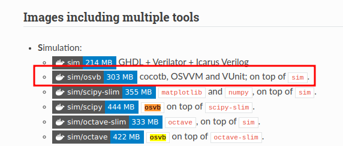

# FPGA and DSP ITBA
Repository for TP Laboratorio DSP and FPGA (ITBA)

Is recommended to run linux either in a partition, virtual machine or with windows wsl.**Ubuntu 22.04**.
## Install Docker

What is docker?
[VIDEO](https://www.youtube.com/watch?v=rOTqprHv1YE)

Follow the instructions of the two following links: 
[INSTALL](https://docs.docker.com/engine/install/ubuntu/) 
[POST_INSTALL](https://docs.docker.com/engine/install/linux-postinstall/)

## Install Anaconda Navigator 
In order to visualize data and make developmente easier use anaconda navigator to see the data

[LINK](https://www.anaconda.com/products/distribution)

## Docker container
As base container que are going to use the following one:

**hdlc/sim:osvb**

[MAIN LINK](https://hdl.github.io/containers/)

## Other Python package
In the dockerfile addd 
**RUN pip3 install fxpmath pyfda cocotbext-axi**

This python packages are also adder.
TODO: Add docker compose
